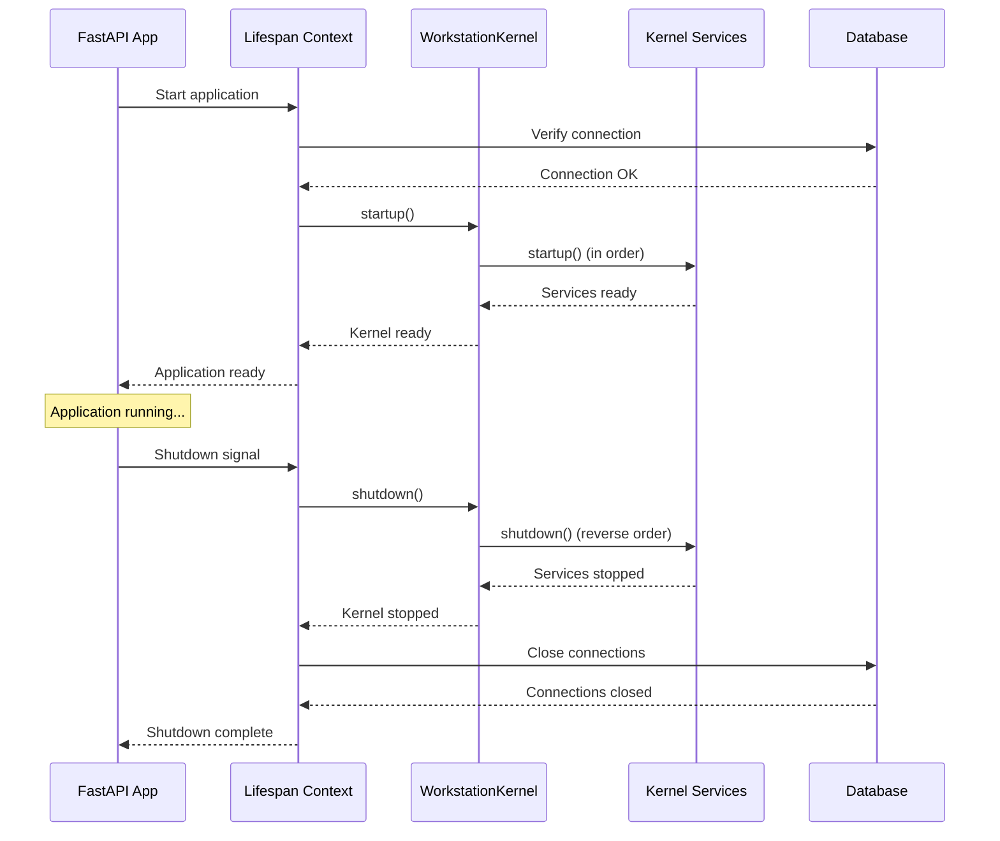

# WorkstationKernel Architecture

The WorkstationKernel provides centralized service lifecycle management for the AI Workstation backend. It coordinates startup, shutdown, and health monitoring for all registered services.

## Purpose

- **Centralized Lifecycle Management**: Single point of control for service initialization and cleanup
- **Ordered Startup/Shutdown**: Services start in registration order and stop in reverse (LIFO)
- **Health Monitoring**: Aggregated health checks for all registered services
- **Graceful Degradation**: Partial failures don't crash the entire system

## Service Registration Pattern

Services implement the `BaseKernelService` interface and register with the kernel:

```python
from app.kernel import WorkstationKernel, BaseKernelService
from typing import Tuple

class MyService(BaseKernelService):
    def __init__(self):
        self._running = False
        self._client = None

    @property
    def name(self) -> str:
        return "my_service"

    @property
    def is_running(self) -> bool:
        return self._running

    async def startup(self) -> None:
        if self._running:
            return  # Idempotent
        self._client = await create_client()
        self._running = True

    async def shutdown(self) -> None:
        if self._client:
            await self._client.close()
            self._client = None
        self._running = False

    async def health_check(self) -> Tuple[bool, str]:
        if not self._running:
            return False, "service not running"
        if not self._client.is_connected:
            return False, "client disconnected"
        return True, "ok"

# Registration (typically in lifespan or service module)
kernel = WorkstationKernel()
kernel.register_service(MyService())
```

## Startup/Shutdown Order Guarantees

Services are started in the order they are registered:

```python
kernel.register_service(DatabaseService())  # Starts first
kernel.register_service(CacheService())     # Starts second
kernel.register_service(ApiService())       # Starts third
```

During shutdown, services stop in reverse order:

```
ApiService.shutdown()      # Stops first
CacheService.shutdown()    # Stops second
DatabaseService.shutdown() # Stops third
```

This ensures dependent services shut down before their dependencies.

## Health Check Contract

Health checks must be:

- **Lightweight**: Complete in under 1 second
- **Non-blocking**: Use async operations
- **Safe**: Never throw unhandled exceptions
- **Accurate**: Return `(False, message)` for any degraded state

Return format: `Tuple[bool, str]` where:
- First element: `True` if healthy, `False` otherwise
- Second element: Human-readable status message

## Example Service Implementation

```python
from app.kernel import BaseKernelService
from typing import Tuple
import redis.asyncio as redis

class RedisService(BaseKernelService):
    """Managed Redis connection pool."""

    def __init__(self, url: str):
        self._url = url
        self._pool = None
        self._running = False

    @property
    def name(self) -> str:
        return "redis"

    @property
    def is_running(self) -> bool:
        return self._running

    async def startup(self) -> None:
        if self._running:
            return
        self._pool = redis.ConnectionPool.from_url(
            self._url,
            max_connections=10
        )
        # Verify connection works
        client = redis.Redis(connection_pool=self._pool)
        await client.ping()
        self._running = True

    async def shutdown(self) -> None:
        if self._pool:
            await self._pool.disconnect()
            self._pool = None
        self._running = False

    async def health_check(self) -> Tuple[bool, str]:
        if not self._running or not self._pool:
            return False, "not running"
        try:
            client = redis.Redis(connection_pool=self._pool)
            await client.ping()
            return True, "ok"
        except Exception as e:
            return False, str(e)

    def get_client(self) -> redis.Redis:
        """Get a Redis client from the pool."""
        if not self._running:
            raise RuntimeError("RedisService not running")
        return redis.Redis(connection_pool=self._pool)
```

## Integration with FastAPI

The kernel integrates with FastAPI's lifespan context:

```python
from contextlib import asynccontextmanager
from fastapi import FastAPI
from app.kernel import WorkstationKernel

@asynccontextmanager
async def lifespan(app: FastAPI):
    # Database verification first
    async with engine.connect() as conn:
        await conn.execute(text("SELECT 1"))

    # Initialize kernel
    kernel = WorkstationKernel()
    kernel.register_service(MyService())
    await kernel.startup()
    app.state.kernel = kernel

    yield

    # Shutdown
    await kernel.shutdown()
    await close_db()

app = FastAPI(lifespan=lifespan)
```

## API Endpoints

### `/api/kernel/health`

Returns detailed kernel health status:

```json
{
  "status": "healthy",
  "kernel": {
    "initialized": true,
    "timestamp": "2024-01-15T10:30:00.000Z",
    "services": {
      "redis": {
        "healthy": true,
        "message": "ok",
        "is_running": true
      }
    }
  }
}
```

Returns 200 if all services healthy, 503 otherwise.

### `/api/kernel/status`

Returns comprehensive debugging information (always 200):

```json
{
  "timestamp": "2024-01-15T10:30:00.000Z",
  "kernel_attached": true,
  "initialized": true,
  "registered_services": ["redis", "ollama"],
  "service_details": {
    "redis": {
      "is_running": true,
      "healthy": true,
      "message": "ok"
    }
  },
  "last_health_check": "2024-01-15T10:29:55.000Z"
}
```

## Sequence Diagram



## Testing

The kernel supports testing via the `_reset()` class method:

```python
import pytest
from app.kernel import WorkstationKernel

@pytest.fixture
def kernel():
    WorkstationKernel._reset()
    kernel = WorkstationKernel()
    yield kernel
    WorkstationKernel._reset()

@pytest.mark.asyncio
async def test_service_startup(kernel):
    service = MockService()
    kernel.register_service(service)
    await kernel.startup()
    assert service.is_running
    await kernel.shutdown()
```

## Best Practices

1. **Idempotent startup**: Check `is_running` before initializing
2. **Graceful shutdown**: Handle missing resources in `shutdown()`
3. **Lightweight health checks**: Avoid expensive operations
4. **Unique names**: Each service needs a distinct name
5. **Dependency order**: Register dependencies before dependents
