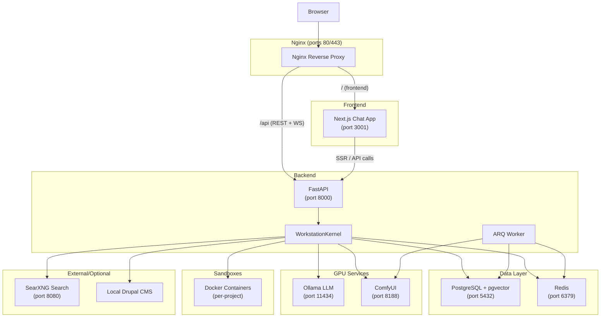
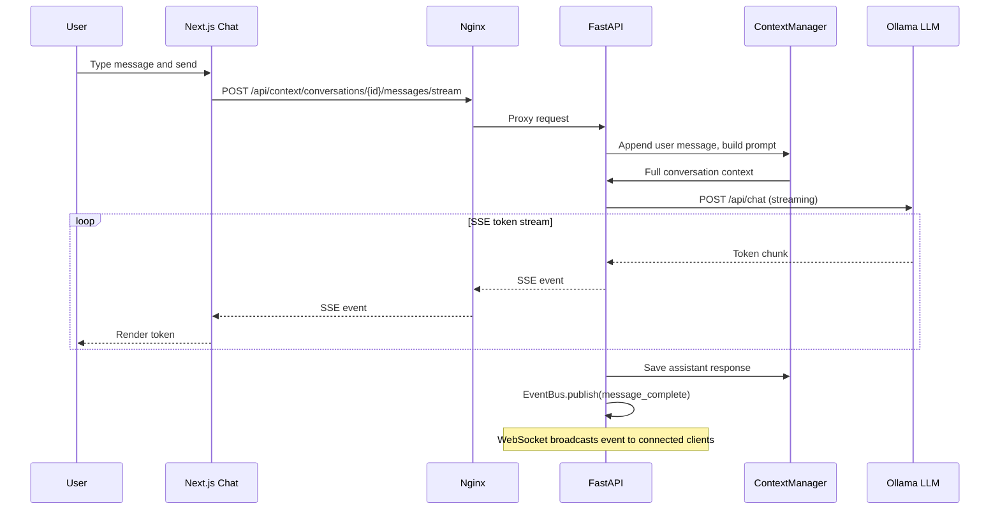
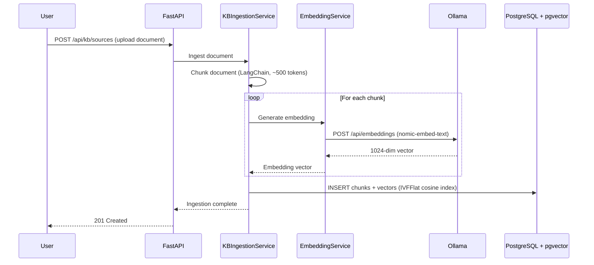
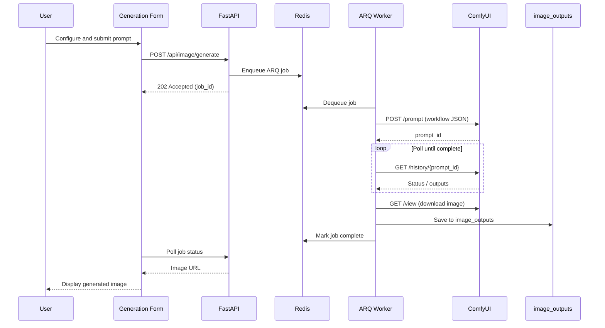

# Architecture Overview

The AI Workstation is a containerized development environment that combines chat-driven AI interaction with code execution sandboxes, knowledge base search, image generation, and external service integrations. All services run as Docker containers orchestrated by Docker Compose, with Nginx as the single entry point.

## System Diagram

### Port Mapping

All internal ports are standard; host ports are offset to avoid conflicts. See the service map in the project [README](../README.md) for the full table.

| Service    | Internal | Default Host |
|------------|----------|--------------|
| Nginx      | 80/443   | 80/443       |
| Chat       | 3001     | 3001         |
| Backend    | 8000     | 8001         |
| PostgreSQL | 5432     | 5433         |
| Redis      | 6379     | 6380         |
| Ollama     | 11434    | 11434        |
| ComfyUI    | 8188     | 8188         |
| SearXNG    | 8080     | 8080         |

## Layer Descriptions

### Frontend -- Next.js 14 + React

A pnpm monorepo under `frontend/` with three packages:

- **`apps/chat`** (port 3001) -- The main UI. Handles chat, workspace/IDE, terminal, image generation, admin panels, and settings. Built on Next.js 14 with the App Router.
- **`packages/ui`** -- Shared component library based on shadcn/ui and Tailwind CSS. Consumed as source (no build step) via `transpilePackages`.
- **`packages/api`** -- TypeScript types mirroring backend Pydantic schemas, a `WorkstationClient` class, and React hooks (`useConversation`, `useWebSocket`, etc.). Also consumed as source.

The frontend communicates with the backend exclusively through the Nginx proxy in production. During local development, it can also hit the backend directly at `localhost:8001`.

### API Gateway -- Nginx

Nginx terminates TLS and routes traffic:

| Path      | Upstream       | Notes                          |
|-----------|----------------|--------------------------------|
| `/`       | `chat:3001`    | Next.js frontend               |
| `/api`    | `backend:8000` | REST API                       |
| `/api/context/conversations/{id}/messages/stream` | `backend:8000` | Dedicated SSE streaming route |
| `/api/ws` | `backend:8000` | WebSocket (long timeout)       |
| `/health` | nginx          | Container health check         |

Nginx performs dynamic Docker DNS re-resolution for upstreams and uses dedicated SSE settings (buffering/compression disabled) on the message stream route. See [nginx/README.md](../nginx/README.md) for TLS setup and troubleshooting.

### Backend -- FastAPI

The backend (`backend/app/main.py`) is a FastAPI application with:

- **JWT authentication** (HS256) -- 30-minute access tokens, 60-minute WebSocket tokens.
- **Middleware stack** -- Rate limiting, CSRF protection, CORS, GZip compression, security headers, request timing.
- **API routers** organized by domain (auth, context, kb, image, sandbox, planning, etc.). All routes are mounted under `/api`.
- **ARQ worker** -- Processes background jobs (image generation, long-running tasks) via Redis queues.

### Kernel Services

The `WorkstationKernel` (a singleton) manages the lifecycle of all backend services. Services implement `BaseKernelService` and are registered during the FastAPI lifespan. The kernel provides ordered startup, reverse-order shutdown, and aggregated health checks.

**Registered services (in startup order):**

1. `EventBus` -- Publishes events to WebSocket clients and persists event history.
2. `ResourceManager` -- CRUD for kernel-managed resources (files, artifacts).
3. `ToolRegistry` -- Registers and invokes tools (web search, code editing, Brevo, desktop control).
4. `ContextManager` -- Conversation context, memory, and session management.
5. `TokenCounter` -- Token counting for context window management.
6. `OllamaClient` -- LLM chat completions and model management.
7. `KBIngestionService` -- Document chunking and processing pipeline.
8. `EmbeddingService` -- Vector embedding generation via Ollama.
9. `ComfyUIClient` -- Image generation workflow submission and polling.
10. `SandboxManager` -- Per-project Docker container lifecycle.
11. `SSHClient` -- SSH operations for VPS/Drupal staging (conditional).
12. `DrupalMCPService` -- Remote Drupal site management (conditional).
13. `BrevoClient` -- Email/SMS marketing via Brevo API (conditional).

For the full service interface, registration pattern, and health check contract, see [backend/app/kernel/README.md](../backend/app/kernel/README.md).

### Data Layer

**PostgreSQL + pgvector** -- Primary data store for users, conversations, projects, knowledge base documents, and vector embeddings. Alembic manages schema migrations. The `pgvector` extension enables similarity search over embeddings stored alongside document chunks.

**Redis** -- Used for:
- Rate limit counters (`rate_limit:global:{ip}:{path}`)
- ARQ task queue (background jobs for the worker)
- WebSocket session tracking
- Ephemeral caching

## Data Flow Diagrams

### Chat Message Flow

### Knowledge Base Ingestion Flow

### Image Generation Flow

## Key Design Decisions

### Kernel Service Pattern

All backend services share a common lifecycle interface (`BaseKernelService`) managed by a single `WorkstationKernel`. This was chosen over ad-hoc initialization for several reasons:

- **Ordered startup/shutdown** -- Services that depend on others (e.g., `EmbeddingService` depends on Ollama being reachable) start in a deterministic order and shut down in reverse.
- **Aggregated health checks** -- A single `/api/kernel/health` endpoint reports the status of every service, simplifying monitoring.
- **Graceful degradation** -- Optional services (SSHClient, DrupalMCPService, BrevoClient) can fail to start without blocking the rest of the system.

### Session-Based Context Management

The `ContextManager` maintains conversation history per session and builds the full prompt (system prompt + conversation history + tool results) before each LLM call. This approach:

- Keeps the frontend stateless (it only sends the new message, not the full history).
- Enables server-side token counting and context window truncation.
- Allows system prompts and tool injection to be managed centrally.

### Event-Driven WebSocket

The `EventBus` publishes domain events (message complete, resource created, operation status change) to all connected WebSocket clients. This decouples producers from consumers -- any service can emit events without knowing who is listening. The frontend subscribes at `GET /api/ws/events?token=<ws_token>` and receives a real-time stream of state changes. See [backend/docs/websocket_reconnection.md](../backend/docs/websocket_reconnection.md) for reconnection and state recovery behavior.

### Background Job Processing

Long-running operations (image generation, document ingestion for large files) are offloaded to an ARQ worker via Redis queues. This keeps API response times fast and allows the worker to be scaled independently. The worker shares the same codebase as the backend and mounts the same volumes (e.g., `image_outputs`).

## Related Documentation

- **Documentation hub**: [docs/README.md](./README.md)
- **Kernel architecture and service interface**: [backend/app/kernel/README.md](../backend/app/kernel/README.md)
- **WebSocket reconnection and state snapshots**: [backend/docs/websocket_reconnection.md](../backend/docs/websocket_reconnection.md)
- **Nginx routing and TLS setup**: [nginx/README.md](../nginx/README.md)
- **Backend development and testing**: [backend/README.md](../backend/README.md)
- **UI accessibility guidelines**: [frontend/packages/ui/ACCESSIBILITY.md](../frontend/packages/ui/ACCESSIBILITY.md)
- **UI responsive system**: [frontend/packages/ui/RESPONSIVE.md](../frontend/packages/ui/RESPONSIVE.md)
